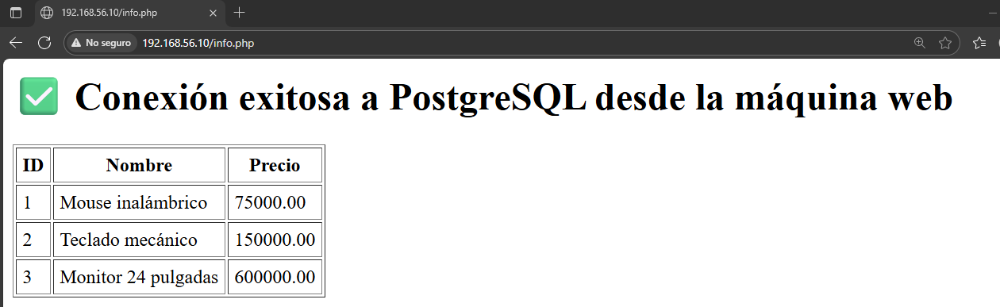

# Taller Autoguiado: Vagrant con Provisionamiento mediante Shell

**Autor:** Santiago Gómez (GitHub: `SantiagoGM2`)  
**Asignatura:** Sistemas Operativos — Taller de virtualización y provisionamiento  
**Fecha:** 2025

## 📘 Descripción General

Este proyecto corresponde al **Taller Autoguiado de Vagrant con Provisionamiento mediante Shell**, cuyo objetivo es **crear y configurar máquinas virtuales con Vagrant**, utilizando scripts automatizados para instalar servicios y desplegar una aplicación web funcional.

El entorno consta de **dos máquinas virtuales**:
- **web:** Servidor con Apache y PHP.  
- **db:** Servidor con PostgreSQL y datos de ejemplo.  

Ambas se comunican mediante una **red privada interna (Host-Only Network)** para simular un entorno cliente-servidor.

---

## ⚙️ Estructura del Proyecto

vagrant-web-provisioning/
├── Vagrantfile
├── provision-web.sh
├── provision-db.sh
├── www/
│ ├── index.html
│ └── info.php
├── screenshots/
│ └── info.png
└── README.md

---
## 📸 Evidencia visual

La siguiente captura muestra la aplicación en funcionamiento desde el navegador:




## 🚀 Pasos de Instalación

### 1️⃣ Clonar el repositorio

Clona el repositorio base o tu fork personal desde GitHub:

```bash
git clone https://github.com/jmaquin0/vagrant-web-provisioning.git
cd vagrant-web-provisioning

2️⃣ Iniciar las máquinas virtuales

Ejecuta el siguiente comando para crear y provisionar ambas máquinas:

vagrant up


Esto levantará:

La máquina web en la IP 192.168.56.10

La máquina db en la IP 192.168.56.11

3️⃣ Verificar el estado de las máquinas
vagrant status


Ambas deben aparecer en estado running.

4️⃣ Acceder a las máquinas

Servidor web:

vagrant ssh web


Servidor de base de datos:

vagrant ssh db

5️⃣ Probar conectividad entre ambas

Desde la máquina web:

ping -c 4 192.168.56.11


Si hay respuesta, la comunicación entre los servidores es correcta.

6️⃣ Verificar la aplicación en el navegador

Abre en tu navegador:

http://192.168.56.10/info.php


Si la configuración es correcta, verás el listado de productos proveniente de la base de datos PostgreSQL.

🧰 Scripts Utilizados
⚙️ provision-web.sh

Script encargado de preparar el servidor web: instala Apache, PHP y el cliente de PostgreSQL, copia los archivos del sitio a /var/www/html y habilita el servicio Apache.

⚙️ provision-db.sh

Script encargado de preparar el servidor de base de datos: instala PostgreSQL, crea el usuario vagrant, la base de datos appdb y la tabla productos con tres registros de ejemplo.
También habilita la conexión remota desde la máquina web.

🌐 Archivos del Sitio
🏠 index.html

Página de inicio con un enlace para consultar los productos desde la base de datos.

💻 info.php

Script PHP que realiza la conexión a la base de datos PostgreSQL y muestra los productos en una tabla HTML.